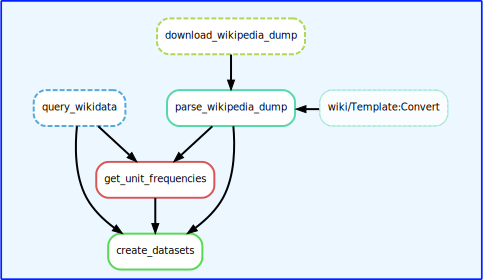

<a href="https://www.fz-juelich.de/en/ice/ice-2"></a>

# Wiki-Quantities and Wiki-Measurements: Datasets of Quantities and their Measurement Context from Wikipedia

Create datasets for quantity span identification and measurement context extraction based on Wikipedia and Wikidata. The code was used to create 
* *Wiki-Quantities*, a dataset consisting of over 1.2 million annotated quantities in the English-language Wikipedia, and 
* *Wiki-Measurements*, a dataset of almost 39k annotated quantities along with their measurement context (primarily the measured entity and property) in the English-language Wikipedia. 

Wiki-Quantities was created based on template calls in the MediaWiki markup. Wiki-Measurements was created by matching Wikidata facts to their corresponding Wikipedia texts. For more information on the datasets, please refer to the respective paper (link will be added once published).


## Installation
A Unix-like operating system is assumed.

0. Clone this repository
1. Create an environment
    ```bash
    mamba env create -f requirements.yml
    mamba activate wikimeasurements_env    
    python3 -m coreferee install en
    ```
2. Download Wikimedia's MediaWiki unit conversion config
    ```bash
    curl -o src/wikimeasurements/static_resources/unitConversionConfig.json https://raw.githubusercontent.com/wikimedia/operations-mediawiki-config/refs/heads/master/wmf-config/unitConversionConfig.json
    ```
3. Download MediaWiki Scribunto extension
    ```bash       
    wget -L -O mediawiki_scrbunto_extension.zip https://github.com/wikimedia/mediawiki-extensions-Scribunto/archive/738ca8d72d3fc9cb14ea650dc137dcc35d2cfe93.zip
    unzip mediawiki_scrbunto_extension.zip -d src/wikimeasurements/mediawiki_modules
    mv src/wikimeasurements/mediawiki_modules/mediawiki-extensions-Scribunto-738ca8d72d3fc9cb14ea650dc137dcc35d2cfe93 src/wikimeasurements/mediawiki_modules/mediawiki-extensions-Scribunto
    ```     
4.  Download convert module files. Note that this is the newest version of the convert module, we tested only version 27.
    ```bash    
    curl -o src/wikimeasurements/mediawiki_modules/mediawiki-extensions-Scribunto/includes/engines/LuaCommon/lualib/convert.lua https://en.wikipedia.org/wiki/Module:Convert?action=raw
    curl -o src/wikimeasurements/mediawiki_modules/mediawiki-extensions-Scribunto/includes/engines/LuaCommon/lualib/convert_text.lua https://en.wikipedia.org/wiki/Module:Convert/text?action=raw
    curl -o src/wikimeasurements/mediawiki_modules/mediawiki-extensions-Scribunto/includes/engines/LuaCommon/lualib/convert_data.lua https://en.wikipedia.org/wiki/Module:Convert/data?action=raw
    curl -o src/wikimeasurements/mediawiki_modules/mediawiki-extensions-Scribunto/includes/engines/LuaCommon/lualib/ConvertNumeric.lua https://en.wikipedia.org/wiki/Module:ConvertNumeric?action=raw
    ```
6. In order to run the convert module to parse convert templates calls, MediaWiki and its Scribunto extension are required. MediaWiki runs in PHP but when processing templates, code written in Lua is invoked. However, we don't want to run a complete MediaWiki instance just for parsing the convert template. Thus we adapt the convert module and some functions of the MediaWiki Scribunto extension to run them stand-alone, that is, without referencing back to MediaWiki PHP. Therefore, rename the follwoing lualib files and apply the following diff patches to make the convert module work without MediaWiki as a dependency (if you are using a different version of the convert module, you may need to adjust the patches).
    ```bash
    mv src/wikimeasurements/mediawiki_modules/mediawiki-extensions-Scribunto/includes/engines/LuaCommon/lualib/mw.ustring.lua src/wikimeasurements/mediawiki_modules/mediawiki-extensions-Scribunto/includes/engines/LuaCommon/lualib/mw_ustring.lua
    mv src/wikimeasurements/mediawiki_modules/mediawiki-extensions-Scribunto/includes/engines/LuaCommon/lualib/mw.text.lua src/wikimeasurements/mediawiki_modules/mediawiki-extensions-Scribunto/includes/engines/LuaCommon/lualib/mw_text.lua
    mv src/wikimeasurements/mediawiki_modules/mediawiki-extensions-Scribunto/includes/engines/LuaCommon/lualib/mw.title.lua src/wikimeasurements/mediawiki_modules/mediawiki-extensions-Scribunto/includes/engines/LuaCommon/lualib/mw_title.lua
    patch src/wikimeasurements/mediawiki_modules/mediawiki-extensions-Scribunto/includes/engines/LuaCommon/lualib/convert.lua < src/wikimeasurements/mediawiki_modules/convert.patch
    patch src/wikimeasurements/mediawiki_modules/mediawiki-extensions-Scribunto/includes/engines/LuaCommon/lualib/mw_text.lua < src/wikimeasurements/mediawiki_modules/mw_text.patch
    ```


## Getting started

Creating the datasets is a workflow involving the execution of multiple steps. Since the workflow is described with Snakemake, it can be run through with a single command. This is described below. If you want detailed information on each program run check [`src/wikimeasurements/README.md`](src/wikimeasurements/) instead.



First, cd into the repo.

To run the full workflow with the sample configuration, you can choose to run:
```bash
snakemake --cores 1
```

In order to run the workflow in a SLURM environment add a SLURM config and run:
```bash
snakemake --profile workflow/slurm
```

If the individual nodes of your cluster do not provide an internet connection, you may run the rules for downloading the Wikipedia dump and querying Wikidata on the head node beforehand.

Each task of the pipeline will write status information to the console and or the log files.

Note that processing a full Wikipedia dump can take a long time and requires a lot of memory. In this case you may want to parallelize the pipeline and assert that you have enough memory.


## More information
For the output data formats, some hints and resources check [`src/wikimeasurements/README.md`](src/wikimeasurements/).


## About Us 

<a href="https://www.fz-juelich.de/en/ice/ice-2"></a>

We are the <a href="https://www.fz-juelich.de/en/ice/ice-2">Institute of Climate and Energy Systems (ICE) - Jülich Systems Analysis</a> belonging to the <a href="https://www.fz-juelich.de/en">Forschungszentrum Jülich</a>. Our interdisciplinary department's research is focusing on energy-related process and systems analyses. Data searches and system simulations are used to determine energy and mass balances, as well as to evaluate performance, emissions and costs of energy systems. The results are used for performing comparative assessment studies between the various systems. Our current priorities include the development of energy strategies, in accordance with the German Federal Government’s greenhouse gas reduction targets, by designing new infrastructures for sustainable and secure energy supply chains and by conducting cost analysis studies for integrating new technologies into future energy market frameworks.

## Acknowledgements

The authors would like to thank the German Federal Government, the German State Governments, and the Joint Science Conference (GWK) for their funding and support as part of the NFDI4Ing consortium. Funded by the German Research Foundation (DFG) – 442146713, this work was also supported by the Helmholtz Association as part of the program “Energy System Design”.

<p float="left">
<a href="https://www.helmholtz.de/en/"></a>
</p>